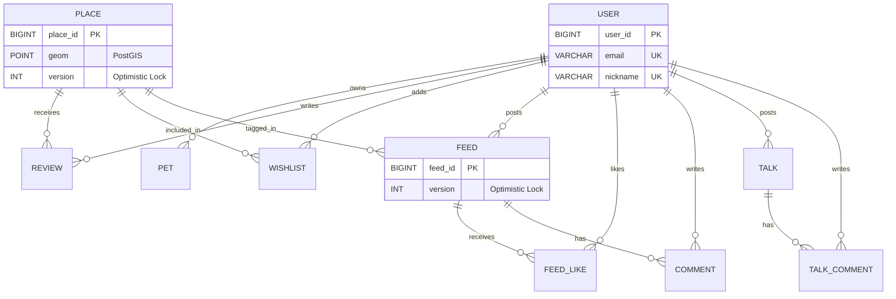

# ERD

# Database ERD & Schema Specification

> **문서 유형**: 데이터베이스 설계서 (SDD 기반)
**적용 기술**: PostgreSQL, PostGIS, JPA Auditing, Optimistic Lock
> 

---

## 🗺️ 1. ERD 다이어그램 (Mermaid)

## 📊 2. 공통 속성 (JPA Auditing - BaseEntity)

모든 테이블은 데이터 추적 및 무결성을 위해 아래의 공통 컬럼을 상속받는다.

- `reg_date` (DATETIME): 데이터 최초 생성일시 (수동 입력 불가, 자동 생성)
- `updated_at` (DATETIME): 데이터 최근 수정일시 (수정 시 자동 갱신)

---

## 🗄️ 3. 상세 테이블 명세

### 👤 USER (회원)

| **컬럼명** | **데이터 타입** | **제약 조건 및 유효성 검사** | **설명** |
| --- | --- | --- | --- |
| `user_id` | BIGINT | PK, AUTO_INCREMENT | 회원 고유 식별자 |
| `email` | VARCHAR | UNIQUE, 필수, 최대 100자 | 로그인 이메일 (이메일 형식) |
| `password` | VARCHAR | 필수, 8~100자 | 암호화된 비밀번호 (영문/숫자/특수문자) |
| `nickname` | VARCHAR | UNIQUE, 필수, 2~20자 | 사용자 표시 닉네임 (공백 불가) |
| `role` | ENUM | 필수 (`USER`, `ADMIN`) | 권한 |
| `status` | ENUM | 필수 (`ACTIVE`, `SUSPENDED`, `BLOCK`, `DELETED`) | 계정 상태 |
| `reg_date` | DATETIME | 자동 저장 (JPA Auditing) | 가입일시 |
| `updated_at` | DATETIME | 자동 갱신 (JPA Auditing) | 회원 정보 수정일시 |

🐾 PET (반려동물 통합)

| **컬럼명** | **데이터 타입** | **제약 조건 및 유효성 검사** | **설명** |
| --- | --- | --- | --- |
| `pet_id` | BIGINT | PK, AUTO_INCREMENT | 반려동물 고유 식별자 |
| `user_id` | BIGINT | FK (USER), 필수 | 소유 회원 ID |
| `pet_name` | VARCHAR(20) | 필수, 1~20자 | 반려동물 이름 |
| `pet_type` | VARCHAR | 필수 (`강아지`, `고양이`) | 반려동물 종류 |
| `pet_breed` | VARCHAR(50) | 필수, 1~50자 | 품종 |
| `pet_gender` | VARCHAR | 필수 (`남아`, `여아`) | 성별 |
| `pet_size` | ENUM | 필수 (`SMALL`, `MEDIUM`, `LARGE`) | 소/중/대형 분류 |
| `pet_age` | INT | 필수, 양수 | 나이 (년) |
| `pet_weight` | DECIMAL | 선택, 양수 | 체중 (kg) |
| `pet_activity` | ENUM | 필수 (`LOW`, `NORMAL`, `HIGH`) | 활동량 |
| `personality` | VARCHAR(100) | 선택, 최대 100자 | 성격 |
| `preferred_place` | VARCHAR(50) | 선택, 최대 50자 | 선호 장소 유형 |
| `is_representative` | BOOLEAN | 기본값 `false` | 대표 동물 여부 (첫 등록 시 자동 `true`) |
| `reg_date` | DATETIME | 자동 저장 (JPA Auditing) | 등록일시 |
| `updated_at` | DATETIME | 자동 갱신 (JPA Auditing) | 정보 수정일시 |

**📍 PLACE (장소)**

| **컬럼명** | **데이터 타입** | **제약 조건 및 유효성 검사** | **설명** |
| --- | --- | --- | --- |
| `place_id` | BIGINT | PK, AUTO_INCREMENT | 장소 고유 식별자 |
| `title` | VARCHAR | 필수, 최대 100자 | 장소명 |
| `cat` | VARCHAR | 필수, 최대 50자 | 카테고리 (place/stay/dining 등) |
| `loc` | VARCHAR | 필수, 최대 255자 | 주소 |
| `img` | VARCHAR | 선택, URL 형식 | 대표 이미지 URL |
| `rating` | DOUBLE | 0.0 ~ 5.0 (자동 계산) | 평균 평점 |
| `review_count` | INT | 0 이상 (자동 계산) | 리뷰 수 |
| `content_id` | VARCHAR | 선택 | 외부 API 원본 ID |
| `mapx` | DOUBLE | 필수 | 경도 (API 연동용) |
| `mapy` | DOUBLE | 필수 | 위도 (API 연동용) |
| `geom` | **POINT** | **PostGIS (SRID:4326), GiST Index** | **고정밀 공간 쿼리용 좌표** |
| `description` | TEXT | 선택 | 장소 설명 |
| `tel` | VARCHAR | 선택 | 전화번호 |
| `homepage` | VARCHAR | 선택 | 홈페이지 주소 |
| `facility_info` | TEXT | 선택 | 시설 정보 (태그 등) |
| `version` | **INT** | **@Version (Optimistic Lock)** | **동시성 제어 (리뷰/평점 갱신 시)** |
| `reg_date` | DATETIME | 자동 저장 (JPA Auditing) | 데이터 최초 적재일 |
| `updated_at` | DATETIME | 자동 갱신 (JPA Auditing) | 데이터 갱신일 |

**📝 REVIEW (장소 리뷰)**

| **컬럼명** | **데이터 타입** | **제약 조건 및 유효성 검사** | **설명** |
| --- | --- | --- | --- |
| `review_id` | BIGINT | PK, AUTO_INCREMENT | 리뷰 고유 식별자 |
| `place_id` | BIGINT | FK (PLACE), 필수 | 대상 장소 |
| `user_id` | BIGINT | FK (USER), 필수 | 작성 회원 |
| `content` | TEXT | 필수, 1~1000자 | 리뷰 내용 |
| `rating` | DOUBLE | 필수, 0.5 ~ 5.0 | 평점 |
| `reg_date` | DATETIME | 자동 저장 (JPA Auditing) | 작성일시 |
| `updated_at` | DATETIME | 자동 갱신 (JPA Auditing) | 수정일시 |

💡 **비즈니스 검증:** `UNIQUE (place_id, user_id)` 복합키 적용 (1인 1리뷰 원칙)
****

**❤️ WISHLIST (찜하기)**

| **컬럼명** | **데이터 타입** | **제약 조건 및 유효성 검사** | **설명** |
| --- | --- | --- | --- |
| `wishlist_id` | BIGINT | PK, AUTO_INCREMENT | 찜 고유 식별자 |
| `user_id` | BIGINT | FK (USER), 필수 | 회원 ID |
| `place_id` | BIGINT | FK (PLACE), 필수 | 장소 ID |
| `reg_date` | DATETIME | 자동 저장 (JPA Auditing) | 찜 등록일시 |

💡 **비즈니스 검증:** `UNIQUE (user_id, place_id)` 복합키 적용 (중복 찜 방지)

**📸 FEED (소셜 피드)**

| **컬럼명** | **데이터 타입** | **제약 조건 및 유효성 검사** | **설명** |
| --- | --- | --- | --- |
| `feed_id` | BIGINT | PK, AUTO_INCREMENT | 피드 고유 식별자 |
| `user_id` | BIGINT | FK (USER), 필수 | 작성 회원 |
| `content` | TEXT | 필수, 1~2000자 | 피드 내용 |
| `image_url` | VARCHAR | 선택, URL 형식 | 이미지 URL |
| `place_id` | BIGINT | FK (PLACE), 선택 | 태그된 장소 ID |
| `place_name` | VARCHAR | 선택, 최대 100자 | 장소명 캐시 |
| `like_count` | INT | 0 이상 (자동 계산) | 좋아요 수 |
| `version` | **INT** | **@Version (Optimistic Lock)** | **동시성 제어 (좋아요 갱신 시)** |
| `reg_date` | DATETIME | 자동 저장 (JPA Auditing) | 작성일시 |
| `updated_at` | DATETIME | 자동 갱신 (JPA Auditing) | 수정일시 |

**👍 FEED_LIKE (피드 좋아요)**

| **컬럼명** | **데이터 타입** | **제약 조건 및 유효성 검사** | **설명** |
| --- | --- | --- | --- |
| `feed_like_id` | BIGINT | PK, AUTO_INCREMENT | 좋아요 고유 식별자 |
| `feed_id` | BIGINT | FK (FEED), 필수 | 대상 피드 |
| `user_id` | BIGINT | FK (USER), 필수 | 누른 회원 |
| `reg_date` | DATETIME | 자동 저장 (JPA Auditing) | 등록일시 |

💡 **비즈니스 검증:** `UNIQUE (feed_id, user_id)` 복합키 적용 (중복 좋아요 방지)
****

**💬 COMMENT (피드 댓글)**

| **컬럼명** | **데이터 타입** | **제약 조건 및 유효성 검사** | **설명** |
| --- | --- | --- | --- |
| `comment_id` | BIGINT | PK, AUTO_INCREMENT | 댓글 고유 식별자 |
| `feed_id` | BIGINT | FK (FEED), 필수 | 대상 피드 |
| `user_id` | BIGINT | FK (USER), 필수 | 작성 회원 |
| `content` | TEXT | 필수, 1~500자 | 댓글 내용 |
| `reg_date` | DATETIME | 자동 저장 (JPA Auditing) | 작성일시 |
| `updated_at` | DATETIME | 자동 갱신 (JPA Auditing) | 수정일시 |

**📢 TALK (커뮤니티 게시글)**

| **컬럼명** | **데이터 타입** | **제약 조건 및 유효성 검사** | **설명** |
| --- | --- | --- | --- |
| `talk_id` | BIGINT | PK, AUTO_INCREMENT | 게시글 고유 식별자 |
| `user_id` | BIGINT | FK (USER), 필수 | 작성 회원 |
| `title` | VARCHAR | 필수, 1~100자 | 게시글 제목 |
| `content` | TEXT | 필수, 1~3000자 | 게시글 내용 |
| `location_name` | VARCHAR | 선택, 최대 100자 | 지역명 |
| `bg_color` | VARCHAR | 선택 | 카드 배경색 (Hex Code 등) |
| `reg_date` | DATETIME | 자동 저장 (JPA Auditing) | 작성일시 |
| `updated_at` | DATETIME | 자동 갱신 (JPA Auditing) | 수정일시 |

**💬 TALK_COMMENT (커뮤니티 댓글)**

| **컬럼명** | **데이터 타입** | **제약 조건 및 유효성 검사** | **설명** |
| --- | --- | --- | --- |
| `talk_comment_id` | BIGINT | PK, AUTO_INCREMENT | 댓글 고유 식별자 |
| `talk_id` | BIGINT | FK (TALK), 필수 | 대상 게시글 |
| `user_id` | BIGINT | FK (USER), 필수 | 작성 회원 |
| `content` | TEXT | 필수, 1~500자 | 댓글 내용 |
| `reg_date` | DATETIME | 자동 저장 (JPA Auditing) | 작성일시 |
| `updated_at` | DATETIME | 자동 갱신 (JPA Auditing) | 수정일시 |