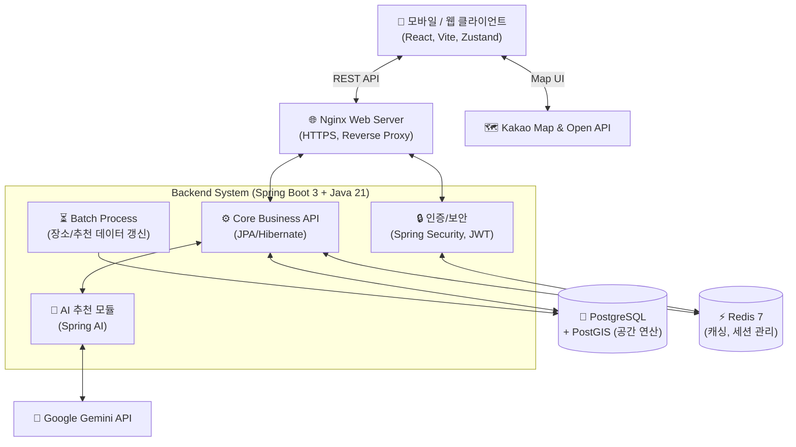

# 🐾 멍냥트립 2.0 (MeongNyangTrip 2.0)

> 반려동물과 함께하는 여행·산책·케어 플랫폼

## ✨ 주요 기능 (Key Features)

-  **멍냥지도**: 내 주변 반려동물 동반 장소 및 산책로 실시간 탐색
-  **AI 산책 가이드**: 나이·날씨를 고려한 **초개인화 AI (Gemini) 산책 코멘트**
-  **멍냥플레이스/스테이**: 검증된 반려동물 동반 가능 숙소/식당 맞춤 큐레이션
-  **멍냥라운지**: 보호자 간 리뷰, 일상, 정보 공유를 위한 소셜 커뮤니티 피드
-  **펫 케어 시스템**: 반려동물 정보 기반 건강 대시보드 및 예방 접종 알림 서비스

## 🏗️ 시스템 아키텍처 (Architecture)



## 🛠️ 기술 스택

| 영역 | 기술 |
|------|------|
| **Frontend** | React (Vite), Tailwind CSS v4, Zustand, Axios, Kakao Map SDK |
| **Backend** | Spring Boot 3.5.11, JDK 21, JPA/Hibernate, PostGIS |
| **Database** | PostgreSQL 16 + PostGIS, Redis 7 |
| **AI** | Spring AI + Google Gemini API |
| **Infra** | AWS (EC2, RDS, S3), Docker, GitHub Actions |
| **Security** | Spring Security, JWT, OAuth 2.0 |

## 📂 프로젝트 구조

```
MeongNyangTrip_2.0/
├── src/                    # 프론트엔드 (React + Vite)
├── backend/                # 백엔드 (Spring Boot 3.5.11)
│   ├── src/main/java/      # Java 소스
│   ├── docker-compose.yml  # 로컬 DB (PostgreSQL + Redis)
│   └── .env.example        # 환경변수 템플릿
└── docs/                   # 프로젝트 문서
    ├── team-guide.md       # 팀 역할 분담 및 협업 가이드
    └── specs/              # 기술 명세서
        ├── core-setup.md   # 코어 인프라 명세
        ├── api-spec.md     # API 명세서
        └── erd.md          # ERD 데이터베이스 설계서
```

## 로컬 실행 방법

### 1. DB 컨테이너 실행
```bash
cd backend
docker compose up -d
```

### 2. 환경변수 설정
```bash
cp .env.example .env
# .env 파일에서 API 키 등 입력
```

### 3. 백엔드 실행
```bash
./gradlew bootRun
# http://localhost:8080
# Swagger UI: http://localhost:8080/swagger-ui.html
```

### 4. 프론트엔드 실행
```bash
cd ..  # 프로젝트 루트로 이동
npm install
npm run dev
# http://localhost:5173
```

## 브랜치 전략

| 브랜치 | 담당 | 설명 |
|--------|------|------|
| `main` | 전체 | 배포용 (PR 머지만 허용) |
| `feat/infra` | 팀원 A | 인프라 & 보안 (AWS, CI/CD, JWT) |
| `feat/backend` | 팀원 B | 코어 데이터 & BE (PostGIS, Redis) |
| `feat/ai` | 팀원 C | AI & 연동 (Gemini, 알림톡) |
| `feat/frontend` | 팀원 D | FE & 인터페이스 |

### 작업 흐름
```bash
git checkout feat/본인브랜치
# 작업 후
git add . && git commit -m "feat: 작업 내용"
git push origin feat/본인브랜치
# GitHub에서 PR 생성 -> 리뷰 -> Merge
```

## 팀 구성

| 담당 | 포지션 | 주요 기술 |
|------|--------|----------|
| 팀원 A | 인프라 & 보안 | AWS, Docker, Spring Security |
| 팀원 B | 코어 데이터 & BE | PostgreSQL, PostGIS, Redis |
| 팀원 C | AI & 연동 | Spring AI, Gemini, Kakao API |
| 팀원 D | FE & 인터페이스 | React, Tailwind CSS, Kakao Map SDK |

## 관련 문서

- [팀 협업 가이드](docs/team-guide.md)
- [코어 인프라 명세서](docs/specs/core-setup.md)
- [API 명세서](docs/specs/api-spec.md)
- [ERD 설계서](docs/specs/erd.md)
- [FE 개발 가이드라인](src/imports/fe-dev-guidelines.md)
