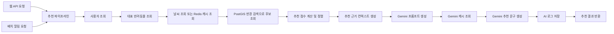
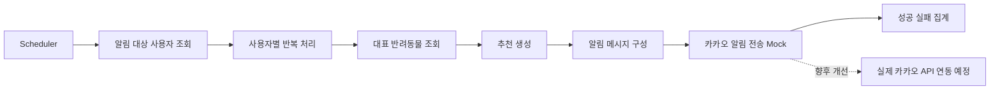

# MeongNyangTrip Backend

## 맡은 역할 : 

반려동물과 함께 갈 수 있는 장소를 추천하는 Spring Boot 기반 백엔드 시스템이다.  
사용자 정보, 대표 반려동물 정보, 현재 날씨, 장소 데이터를 조합해 추천 후보를 추리고 점수를 계산한 뒤, Gemini로 추천 문구를 생성한다.  
조회 API와 배치 알림 흐름이 같은 추천 파이프라인을 공유하도록 구성했다.

## 1. 프로젝트 소개

이 프로젝트는 단순 CRUD를 넘어, 아래 요소를 하나의 추천 흐름으로 연결하는 데 초점을 맞췄다.

- 사용자 조회
- 대표 반려동물 조회
- 날씨 조회 및 Redis 캐시
- PostGIS 기반 반경 검색
- 점수 계산 기반 추천 정렬
- 추천 근거 컨텍스트 생성
- Gemini 프롬프트 및 추천 문구 생성
- AI 응답 로그 저장
- 배치 기반 추천 알림 처리

## 2. 프로젝트 목표

- 반려동물과 보호자의 상황에 맞는 추천 결과를 일관된 파이프라인으로 제공한다.
- 위치 기반 후보 검색과 점수 계산 로직을 분리해 추천 과정을 설명 가능하게 만든다.
- AI 문구 생성은 추천 결과 위에 얹는 단계로 두고, 추천 근거와 생성 단계를 분리한다.
- 웹 조회와 배치 알림이 같은 추천 로직을 재사용하도록 설계한다.

## 3. 핵심 기능

- 사용자 조회 및 대표 반려동물 조회
- 기상청 초단기 실황 조회
- Redis 기반 날씨 조회 캐시
- PostGIS `ST_DWithin` 기반 반경 내 장소 후보 조회
- 날씨, 반려동물, 거리, 장소 특성을 반영한 추천 점수 계산
- 추천 근거 컨텍스트 생성
- Gemini 프롬프트 생성 및 추천 문구 생성
- Redis 기반 Gemini 응답 캐시
- AI 응답 로그 저장
- 스케줄러 기반 일일 추천 배치
- 사용자별 반복 처리 및 알림 메시지 구성
- 카카오 알림 전송

## 4. 시스템 흐름



웹 조회와 배치 알림은 진입점만 다르고, 내부 추천 생성 흐름은 동일하다.  
이 구조 덕분에 추천 기준이 한 곳에 모이고, 테스트와 유지보수 범위를 줄일 수 있다.

## 5. 아키텍처 / 추천 파이프라인

추천 파이프라인은 크게 5단계로 나뉜다.

1. 사용자/반려동물/날씨 입력 수집  
2. 위치 기반 후보 장소 수집  
3. 점수 계산 및 상위 장소 선정  
4. 추천 근거 컨텍스트 조립  
5. Gemini 문구 생성 및 로그 저장

핵심은 "추천 결과를 먼저 계산하고, AI는 그 결과를 설명하는 역할만 맡는다"는 점이다.  
즉, 추천 품질의 중심은 점수 계산 로직에 두고, 생성형 AI는 표현 계층으로 분리했다.

## 6. 기술 스택

| 구분 | 기술 |
| --- | --- |
| Language | Java 21 |
| Framework | Spring Boot 3.5.11 |
| Web | Spring Web, Validation |
| Data | Spring Data JPA, PostgreSQL |
| Spatial | PostGIS, Hibernate Spatial |
| Cache | Redis |
| AI | Spring AI, Google Gemini |
| Batch | Spring Scheduler |
| Docs | Swagger / Springdoc OpenAPI |
| Test | JUnit 5, Mockito |

## 7. 주요 설계 포인트

### 7-1. 추천 파이프라인 분리

추천 흐름을 `RecommendationPipelineService` 중심으로 모아 웹 요청과 배치 요청이 동일한 로직을 재사용하도록 구성했다.

### 7-2. PostGIS 기반 반경 검색

장소 후보 수집은 단순 문자열 검색이 아니라 `PlaceRepository.findNearby(...)`의 `ST_DWithin` 쿼리로 처리한다.  
후보군을 먼저 위치 기준으로 좁힌 뒤, 이후 필터링과 점수 계산을 적용한다.

### 7-3. Redis 이중 캐시

- 날씨 캐시: 같은 격자 좌표에 대한 반복 조회 비용을 줄인다.
- Gemini 캐시: 동일한 프롬프트에 대한 AI 호출을 줄인다.
- Daily recommendation cache: 배치에서 확정된 오늘의 추천 결과를 사용자별로 재사용한다.

캐시 대상이 서로 다르기 때문에, 외부 API 비용과 응답 지연을 각각 다른 지점에서 줄일 수 있다.
Gemini 응답은 prompt sha256 기반으로 Redis에 저장한다.
배치 완료 후 사용자별 daily recommendation cache 를 저장한다.
웹 조회 시 당일 발송 이력이 있으면 daily cache 를 우선 조회한다.
Redis key prefix 는 version suffix 없이 `weather:{...}`, `gemini:{model}:{sha256(prompt)}`, `recommendation:daily:{userId}:{yyyyMMdd}` 형태로 단순화했다.

### 7-4. 추천 근거와 AI 문구 생성 분리

`RecommendationEvidenceContextService`에서 추천 근거를 정리하고,  
`RecommendationPromptService`에서 Gemini 입력용 프롬프트를 만든다.  
이 분리를 통해 추천 이유를 코드 레벨에서 추적하기 쉽고, 프롬프트 수정도 독립적으로 가능하다.

### 7-5. AI 응답 로그 저장

프롬프트, 추천 후보 요약, 컨텍스트 스냅샷, AI 응답, fallback 여부, cache hit 여부를 별도 로그 엔티티로 남긴다.  
운영 시 품질 점검과 회귀 확인에 필요한 최소한의 추적성을 확보하려는 의도다.

### 7-6. 배치 기반 알림 처리

일일 배치에서 알림 수신 동의 사용자를 조회하고, 사용자별 대표 반려동물을 매핑한 뒤 추천 생성과 메시지 전송을 수행한다.  
사용자 단위 처리가 분리되어 있어, 한 사용자 실패가 전체 배치를 중단시키지 않도록 설계했다.

## 8. 현재 구현 범위

### 구현 완료

| 영역 | 현재 상태 |
| --- | --- |
| 사용자 조회 | 구현 완료 |
| 대표 반려동물 조회 | 구현 완료 |
| 날씨 조회 | 구현 완료 |
| Redis 기반 날씨 캐시 | 구현 완료 |
| 장소 후보 조회 | PostGIS 반경 검색 기반으로 구현 완료 |
| 추천 점수 계산 | 구현 완료 |
| 추천 근거 컨텍스트 생성 | 구현 완료 |
| Gemini 프롬프트 생성 | 구현 완료 |
| Redis 기반 Gemini 캐시 | 구현 완료 |
| Gemini 추천 문구 생성 | 구현 완료 |
| AI 로그 저장 | 구현 완료 |
| 배치 스케줄러 기반 추천 흐름 | 구현 완료 |
| 사용자별 반복 추천 처리 | 구현 완료 |
| 알림 메시지 구성 | 구현 완료 |
| 카카오 알림 전송 | mock client 구조까지 구현 완료 |

### 현재 구현 기준에서 명확히 알아둘 점

- 날씨 캐시는 "조회 시 캐시" 방식으로 동작한다.
- Gemini 응답은 prompt sha256 기반 Redis 캐시를 사용한다.
- 배치 성공 후 사용자별 daily recommendation cache 를 저장하고, 웹 조회에서 당일 결과를 재사용한다.
- 날씨를 미리 적재하는 pre-warming 배치는 아직 TODO 상태다.
- 카카오 알림은 실제 외부 API 연동이 아니라 `KakaoNotificationClient` mock 구조다.
- 사용자 위치는 현재 실제 사용자 좌표가 아니라 추천 파이프라인 내부 상수 좌표를 사용한다.
- 웹 조회 API와 배치 알림은 같은 추천 파이프라인을 사용한다.

## 9. TODO / 향후 개선 사항

운영 고도화 관점에서 남아 있는 항목은 아래 3가지다.  
핵심 추천 기능 자체는 동작하지만, 실제 서비스 운영 완성도를 높이기 위해 필요한 작업들이다.

### 9-1. 날씨 미리 캐시

- 현재는 조회가 들어왔을 때 날씨를 캐시에 적재한다.
- 향후에는 스케줄러로 주요 지역의 날씨를 사전 적재해, 첫 요청 지연을 더 줄일 예정이다.

### 9-2. 실제 카카오 알림 전송 연동

- 현재는 `KakaoNotificationClient`가 mock 응답을 반환한다.
- 향후 실제 카카오 알림 API와 연동해 템플릿, 발신 키, 실패 처리 정책을 운영 수준으로 보완할 예정이다.

### 9-3. 상수 좌표를 실제 사용자 좌표 기반으로 변경

- 현재 추천 파이프라인은 내부 상수 좌표를 기준으로 반경 검색과 날씨 조회를 수행한다.
- 향후 사용자 저장 좌표 또는 실시간 위치 입력을 반영하도록 변경할 예정이다.

## 10. 실행 방법

### 사전 준비

- Java 21
- Docker / Docker Compose
- PostgreSQL + PostGIS
- Redis

### 1. 인프라 실행

```bash
cd backend
docker compose up -d
```

### 2. 환경 변수 설정

`backend/.env` 파일에 아래 값들을 준비한다.

```env
DB_HOST=localhost
DB_PORT=5432
DB_NAME=meongnyang
DB_USERNAME=meongnyang
DB_PASSWORD=meongnyang1234
REDIS_HOST=localhost
REDIS_PORT=6379
GEMINI_API_KEY=your_key
WEATHER_API_KEY=your_key
JWT_SECRET=your_secret
```

### 3. 애플리케이션 실행

```bash
cd backend
./gradlew bootRun
```

### 4. 확인

- Server: `http://localhost:8080`
- Swagger UI: `http://localhost:8080/swagger-ui.html`
- Recommendation API: `GET /api/v1/ai/walk-guide`

## 11. 디렉토리 또는 패키지 구조

```text
src/main/java/com/team/meongnyang
├─ recommendation
│  ├─ cache
│  ├─ context
│  ├─ controller
│  ├─ dto
│  ├─ log
│  ├─ notification
│  ├─ service
│  └─ weather
├─ batch/notification
├─ place
├─ user
├─ config
└─ security
```

### 패키지 역할

- `recommendation.service`: 추천 파이프라인, 후보 조회, 점수 계산, 프롬프트 생성
- `recommendation.context`: 추천 근거 컨텍스트 조립
- `recommendation.cache`: 날씨/Gemini Redis 캐시
- `recommendation.notification`: 알림 메시지 구성, 카카오 전송 구조
- `batch.notification`: 스케줄러와 사용자별 배치 처리
- `place`: 장소 엔티티, PostGIS 조회
- `user`: 사용자 및 반려동물 조회

## 12. 트러블슈팅 또는 기술적 고민

### 12-1. AI가 추천을 결정하지 않도록 분리

생성형 AI에 추천 자체를 맡기면 결과 일관성과 디버깅 가능성이 떨어진다.  
그래서 추천 순위는 코드 기반 점수 계산으로 확정하고, AI는 그 결과를 설명하는 역할로 제한했다.

### 12-2. 외부 API 호출 비용과 지연 관리

날씨 API와 Gemini 호출은 모두 지연과 비용이 있는 구간이다.  
그래서 날씨와 Gemini에 각각 Redis 캐시를 두고, timeout / retry / fallback 흐름을 코드에 포함했다.

### 12-3. 배치 실패 전파 최소화

배치 알림은 사용자별 독립 처리가 중요하다.  
한 사용자에서 추천 실패 또는 알림 실패가 발생해도 전체 배치가 중단되지 않도록 사용자 단위 처리와 집계 로그 구조를 적용했다.

### 12-4. 위치 기반 검색과 후속 필터링의 역할 분리

반경 검색은 DB(PostGIS)에서 처리하고, 날씨 적합성, 실내외 성격, 선호 장소 우선순위 같은 정책은 서비스 레이어에서 처리했다.  
공간 검색과 추천 정책을 분리해 쿼리 복잡도를 과도하게 키우지 않으려는 판단이다.

## 13. 회고 또는 기대 효과

이 프로젝트는 추천 파이프라인, 캐시, 위치 기반 검색, AI 문구 생성, 배치 알림이 하나의 백엔드 흐름으로 연결된 구조를 갖는다.  
핵심 추천 기능은 이미 구현되어 있으며, 남은 항목은 날씨 pre-warming, 실제 카카오 연동, 실제 사용자 좌표 반영 같은 운영 완성도 개선 작업이다.

포트폴리오 관점에서는 다음을 보여줄 수 있다.

- 추천 로직을 CRUD 수준에서 끝내지 않고 파이프라인으로 설계한 점
- PostGIS와 Redis를 실제 문제에 맞게 사용한 점
- 생성형 AI를 추천 엔진이 아니라 설명 계층으로 분리한 점
- 배치 알림까지 포함해 운영 흐름을 고려한 점

## 배치 알림 흐름



현재 배치 알림 흐름은 스케줄러부터 사용자별 추천 생성, 메시지 구성, mock 전송까지 연결되어 있다.  
즉, 배치 구조 자체는 구현되어 있고, 외부 알림 채널만 실제 연동 단계가 남아 있다.
