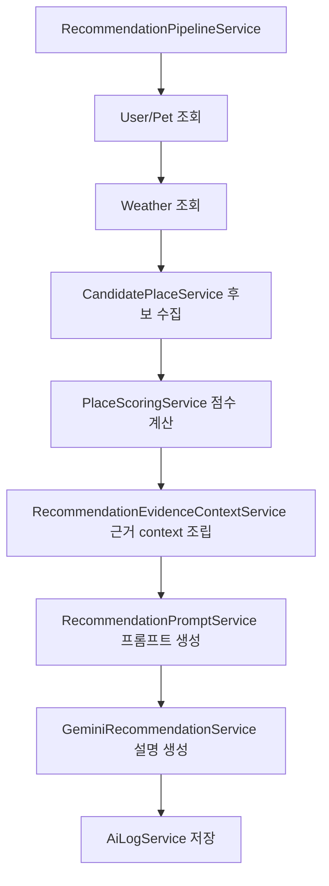

# AI Context Refactor Proposal

## 1. 왜 기존 RAG가 약한가

현재 구조에서 RAG는 [`RagService`](C:\Users\YONSAI\Desktop\MeongNyangTrip_2.0\backend\src\main\java\com\team\meongnyang\recommendation\rag\service\RagService.java)가 PDF 기반 일반 문서를 벡터 검색하고, 그 결과를 [`RecommendationPromptService`](C:\Users\YONSAI\Desktop\MeongNyangTrip_2.0\backend\src\main\java\com\team\meongnyang\recommendation\service\RecommendationPromptService.java)에 넣는 구조다. 이 접근은 "일반 반려견 상식 보강"에는 의미가 있지만, 현재 서비스의 추천 설명 품질을 차별화하기에는 한계가 분명하다.

- 일반 건강/산책 상식은 Gemini 같은 LLM이 이미 잘 알고 있다.
- 검색 결과가 현재 추천된 장소 자체와 직접 연결되지 않는다.
- "왜 이 장소가 1위인가"보다 "일반적으로 비 오는 날 산책 주의" 같은 보조 설명으로 흐르기 쉽다.
- 벡터 검색 결과가 추천 점수 계산 로직과 별개라서 설명과 랭킹 근거가 분리된다.
- 문서 chunk가 실제 서비스 DB의 최신 상태, 장소 검증 여부, 태그, 평점, 리뷰 수, 추천 점수 breakdown을 반영하지 못한다.
- 결국 현재 RAG는 추천 정확도를 올리는 핵심 계층이 아니라, 프롬프트 주변부에 들어가는 일반 배경지식 계층에 가깝다.

정리하면, 지금 구조는 "RAG를 붙였다"는 설명은 가능하지만 "우리 서비스만의 데이터로 설명을 강화한다"는 관점에서는 약하다.

## 2. 앞으로 AI 프롬프트에 넣어야 할 데이터 우선순위

기준은 단순하다. LLM이 원래 잘 모르는 것, 그리고 우리 서비스 안에만 있는 것을 우선 넣어야 한다.

### 우선순위 1. 추천된 장소의 메타데이터

출처 후보:
- [`Place`](C:\Users\YONSAI\Desktop\MeongNyangTrip_2.0\backend\src\main\java\com\team\meongnyang\place\entity\Place.java)

프롬프트에 필요한 값:
- 장소명
- 카테고리
- 주소 또는 거리
- 실내/실외 추정 근거
- 태그
- overview / description
- 반려동물 동반 관련 필드
  - `chkPetInside`
  - `accomCountPet`
  - `petTurnAdroose`
- 검증 여부 `isVerified`
- 평점 `rating`
- 리뷰 수 `reviewCount`
- AI 보정 평점 `aiRating`

이 데이터는 "추천 대상 그 자체"에 대한 설명 재료이므로 가장 중요하다.

### 우선순위 2. 추천 점수 breakdown

출처 후보:
- [`ScoredPlace`](C:\Users\YONSAI\Desktop\MeongNyangTrip_2.0\backend\src\main\java\com\team\meongnyang\recommendation\dto\ScoredPlace.java)
- [`ScoreBreakdown`](C:\Users\YONSAI\Desktop\MeongNyangTrip_2.0\backend\src\main\java\com\team\meongnyang\recommendation\dto\ScoreBreakdown.java)
- [`ScoreDetail`](C:\Users\YONSAI\Desktop\MeongNyangTrip_2.0\backend\src\main\java\com\team\meongnyang\recommendation\dto\ScoreDetail.java)
- [`PlaceScoringService`](C:\Users\YONSAI\Desktop\MeongNyangTrip_2.0\backend\src\main\java\com\team\meongnyang\recommendation\service\PlaceScoringService.java)

프롬프트에 필요한 값:
- 총점
- 섹션별 점수
  - `dogFitScore`
  - `weatherScore`
  - `placeEnvScore`
  - `distanceScore`
  - `historyScore`
  - `penaltyScore`
- breakdown summary
- score detail reason 중 상위 2~4개 핵심 근거

이 데이터가 핵심이다. 앞으로 AI 설명은 "문서 검색 결과"보다 "우리 랭킹 엔진이 왜 이렇게 계산했는지"를 말해야 한다.

### 우선순위 3. 날씨 context

출처 후보:
- [`WeatherContext`](C:\Users\YONSAI\Desktop\MeongNyangTrip_2.0\backend\src\main\java\com\team\meongnyang\recommendation\weather\dto\WeatherContext.java)

프롬프트에 필요한 값:
- `walkLevel`
- `temperature`
- `humidity`
- `precipitationType`
- `rainfall`
- `windSpeed`
- `raining`, `hot`, `cold`, `windy`

날씨는 이미 파이프라인에서 강하게 쓰고 있으므로 유지하되, 일반 상식 설명보다 "이번 추천에 어떤 제약을 줬는지" 중심으로 넣어야 한다.

### 우선순위 4. 사용자/반려견 정보 중 설명에 필요한 값

출처 후보:
- [`User`](C:\Users\YONSAI\Desktop\MeongNyangTrip_2.0\backend\src\main\java\com\team\meongnyang\user\entity\User.java)
- [`Pet`](C:\Users\YONSAI\Desktop\MeongNyangTrip_2.0\backend\src\main\java\com\team\meongnyang\user\entity\Pet.java)

프롬프트에 필요한 값:
- 반려견 이름
- 견종
- 크기
- 나이
- 활동량
- 성격
- 선호 장소
- 닉네임은 톤 조절용으로만 선택적 사용

주의:
- 설명과 직접 상관없는 개인정보는 넣지 않는다.
- 사용자 식별용 값보다 추천 판단에 쓰인 값만 넣는 것이 안전하다.

### 우선순위 5. 향후 확장용 리뷰 요약 데이터

출처 후보:
- [`Review`](C:\Users\YONSAI\Desktop\MeongNyangTrip_2.0\backend\src\main\java\com\team\meongnyang\review\entity\Review.java)
- [`ReviewService`](C:\Users\YONSAI\Desktop\MeongNyangTrip_2.0\backend\src\main\java\com\team\meongnyang\review\service\ReviewService.java)

향후 넣을 값:
- 최근 리뷰 요약
- 긍정 키워드
- 주의 키워드
- 반려동물 동반 관련 리뷰만 추린 요약
- "조용함", "붐빔", "실내 쾌적", "주차", "바닥 상태", "직원 친절" 같은 설명성 속성

이건 현재 즉시 필수는 아니지만, 내부 데이터 기반 AI 설명을 고도화할 때 가장 효과가 큰 확장 포인트다.

## 3. 용어 재정의: 이걸 RAG라고 부르는 게 맞는가

결론부터 말하면, 현재 개선 방향의 중심은 전통적 의미의 RAG보다 "내부 데이터 기반 context injection"에 더 가깝다.

### 추천 용어

- 대외 설명: `추천 근거 주입 기반 AI 설명 생성`
- 아키텍처 명칭: `DB Context Injection`
- 내부 구현 명칭: `Recommendation Evidence Context`
- 문서 제목: `설명 보강 context 구성`

### 왜 이렇게 부르는 게 맞는가

- 주 데이터 소스가 벡터 검색 문서가 아니라 서비스 DB와 스코어링 결과다.
- 검색보다 조립이 핵심이다.
- retrieval보다 evidence selection이 핵심이다.
- 설명 대상이 "일반 지식 질의응답"이 아니라 "우리 추천 결과 설명"이다.

### 권장 표현 전략

- 완전히 RAG를 버렸다고 말할 필요는 없다.
- 이렇게 설명하는 것이 가장 자연스럽다.

> 기존에는 공식 문서 기반 RAG로 일반 반려견 상식을 보강했다면, 앞으로는 추천 엔진이 계산한 내부 데이터와 근거를 AI 프롬프트에 직접 주입하는 방식으로 전환한다. 즉, 일반 지식 검색형 RAG에서 추천 설명 특화형 evidence/context injection 구조로 리팩토링한다.

## 4. 현재 구조 기준 리팩토링 방향

현재 파이프라인의 핵심 흐름은 [`RecommendationPipelineService`](C:\Users\YONSAI\Desktop\MeongNyangTrip_2.0\backend\src\main\java\com\team\meongnyang\recommendation\service\RecommendationPipelineService.java)에 몰려 있다.

현재 순서:

1. 사용자/반려견 조회
2. 날씨 조회
3. 후보 장소 조회
4. 일반 문서 RAG 조회
5. 장소 점수 계산
6. 프롬프트 생성
7. Gemini 호출

권장 순서:

1. 사용자/반려견 조회
2. 날씨 조회
3. 후보 장소 조회
4. 장소 점수 계산
5. 추천 설명용 evidence/context 조립
6. 프롬프트 생성
7. Gemini 호출
8. 로그 저장

핵심 차이:
- `RagService.searchContext(...)`를 중심에서 빼고
- `ScoredPlace` 기반 evidence 조립을 중심에 둔다

## 5. 추천 책임 분리안

### 5.1 새로 두면 좋은 서비스

#### `RecommendationEvidenceContextService`

역할:
- 추천 설명에 필요한 내부 근거를 조립하는 메인 서비스
- 기존 `RagService`의 자리를 대체하는 핵심 계층

추천 메서드:

```java
RecommendationEvidenceContext buildContext(
    User user,
    Pet pet,
    WeatherContext weather,
    List<ScoredPlace> rankedPlaces
)
```

반환 DTO 예시:

```java
public record RecommendationEvidenceContext(
    UserContext userContext,
    PetContext petContext,
    WeatherPromptContext weatherContext,
    List<PlaceEvidence> topPlaces,
    List<String> globalRules,
    String promptBlock
) {}
```

#### `PlaceEvidenceAssembler`

역할:
- `Place` + `ScoredPlace`를 LLM용 설명 근거 블록으로 변환

추천 메서드:

```java
PlaceEvidence assemble(ScoredPlace scoredPlace, int rank);
```

포함 내용:
- 장소 메타데이터 정규화
- 상위 점수 이유 추출
- 감점 이유 추출
- "이 장소가 특히 맞는 상황" 한 줄 생성

#### `ScoreEvidenceExtractor`

역할:
- `breakdowns`, `scoreDetails`에서 설명 가치가 높은 근거만 추출

추천 메서드:

```java
List<EvidenceItem> extractTopReasons(ScoredPlace scoredPlace, int limit);
List<EvidenceItem> extractPenaltyReasons(ScoredPlace scoredPlace, int limit);
```

선정 규칙 예시:
- 점수가 큰 section 우선
- summary가 있는 breakdown 우선
- penalty 존재 시 반드시 1개 포함
- 동일 의미 반복 제거

#### `RecommendationContextFormatter`

역할:
- 조립된 context DTO를 실제 prompt block 문자열로 포맷팅
- `RecommendationPromptService` 내부 문자열 조립 부담 축소

추천 메서드:

```java
String formatForPrompt(RecommendationEvidenceContext context);
```

#### `ReviewSummaryService` 또는 `PlaceReviewInsightService`

역할:
- 향후 리뷰 기반 설명을 위한 확장 포인트

추천 메서드:

```java
Optional<ReviewInsight> summarizeForPlace(Long placeId);
Map<Long, ReviewInsight> summarizeForPlaces(List<Long> placeIds);
```

### 5.2 기존 서비스 책임 조정

#### [`RecommendationPipelineService`](C:\Users\YONSAI\Desktop\MeongNyangTrip_2.0\backend\src\main\java\com\team\meongnyang\recommendation\service\RecommendationPipelineService.java)

지금:
- 날씨 조회
- 후보 조회
- RAG 조회
- 점수 계산
- 프롬프트 생성
- 캐시
- Gemini
- 로그

권장:
- orchestration만 담당
- context 내부 조립 로직은 외부 서비스로 위임

권장 메서드 흐름:

```java
List<ScoredPlace> rankedPlaces = placeScoringService.scorePlaces(...);
RecommendationEvidenceContext evidenceContext =
    recommendationEvidenceContextService.buildContext(user, pet, weatherContext, rankedPlaces);
String prompt = recommendationPromptService.buildRecommendationPrompt(evidenceContext);
```

#### [`RecommendationPromptService`](C:\Users\YONSAI\Desktop\MeongNyangTrip_2.0\backend\src\main\java\com\team\meongnyang\recommendation\service\RecommendationPromptService.java)

지금:
- user/pet/weather/rankedPlaces/ragContext를 모두 직접 문자열로 조립

권장:
- prompt template 전담
- 내부 데이터 추출 책임 제거

권장 시그니처:

```java
String buildRecommendationPrompt(RecommendationEvidenceContext context);
```

#### [`RagService`](C:\Users\YONSAI\Desktop\MeongNyangTrip_2.0\backend\src\main\java\com\team\meongnyang\recommendation\rag\service\RagService.java)

권장 방향 2가지:

1. 축소 유지
- 이름을 `GuidelineContextService`로 변경
- 일반 문서 검색은 선택적 보조 컨텍스트로만 사용
- 악천후 안전수칙 같은 경우에만 얇게 삽입

2. 단계적 제거
- 기본 플로우에서는 제거
- 리뷰 임베딩이나 장소 설명 임베딩이 생기기 전까지는 비활성화

실무적으로는 1번이 안전하다.

## 6. 바로 적용 가능한 데이터 구조 제안

### `PlaceEvidence`

```java
public record PlaceEvidence(
    int rank,
    Long placeId,
    String placeName,
    String category,
    String address,
    double totalScore,
    PlaceMetadataContext metadata,
    ScoreEvidenceContext scoreEvidence,
    String recommendationScenario,
    String caution
) {}
```

### `PlaceMetadataContext`

```java
public record PlaceMetadataContext(
    boolean verified,
    Double rating,
    Integer reviewCount,
    Double aiRating,
    String tags,
    String overview,
    String petInsideAllowed,
    String petAllowanceNote
) {}
```

### `ScoreEvidenceContext`

```java
public record ScoreEvidenceContext(
    double dogFitScore,
    double weatherScore,
    double placeEnvScore,
    double distanceScore,
    double bonusScore,
    double penaltyScore,
    List<String> strengths,
    List<String> cautions
) {}
```

## 7. 프롬프트 구성 원칙

앞으로 프롬프트는 "설명 가능한 추천 결과"를 전달해야 한다. 따라서 입력 구조도 아래처럼 바꾸는 것이 좋다.

### 기존 방식

- 사용자 정보
- 반려견 정보
- 날씨 정보
- Top3 장소 요약
- RAG 참고 문서

### 권장 방식

- 추천 상황 요약
- 반려견 핵심 프로필
- 날씨 제약
- Top3 장소 evidence
- 1위와 2, 3위의 차이점
- 선택적 보조 guideline

예시 블록:

```text
[RECOMMENDATION EVIDENCE]
- 오늘 추천은 "비가 오고 바람이 있어 실내/혼합형 장소 우선" 원칙으로 정렬됨
- 반려견 핵심 프로필: 중형견, 활동량 HIGH, 성격 활발, 선호 장소는 공원

[TOP PLACE EVIDENCE]
1위:
- 장소명: ...
- 총점: 84.5
- 핵심 강점: 반려견 적합도 높음, 날씨 제약에 유리함, 거리 부담 적음
- 세부 근거: ...
- 주의점: ...

2위:
...

3위:
...
```

이렇게 해야 모델이 일반론보다 근거 비교를 중심으로 설명하게 된다.

## 8. RecommendationPipeline 안에서 어디서 context를 만들 것인가

가장 적절한 위치는 `placeScoringService.scorePlaces(...)` 직후다.

이유:
- 후보가 아니라 랭킹 결과가 나온 뒤여야 "왜 1위인가"를 설명할 수 있다.
- `ScoredPlace`에는 이미 explanation에 필요한 점수 구조가 들어 있다.
- 그 이전 단계에서 context를 만들면 후보가 바뀔 때 설명과 순위가 어긋날 수 있다.

권장 흐름:



### 파이프라인 의사코드

```java
WeatherContext weatherContext = weatherService.getOrLoadWeather(nx, ny);
List<Place> candidates = candidatePlaceService.getInitialCandidates(...);
List<ScoredPlace> rankedPlaces = placeScoringService.scorePlaces(...);

RecommendationEvidenceContext evidenceContext =
        recommendationEvidenceContextService.buildContext(user, pet, weatherContext, rankedPlaces);

String prompt = recommendationPromptService.buildRecommendationPrompt(evidenceContext);
String geminiMessage = geminiRecommendationService.generateRecommendation(prompt);
```

## 9. 단계별 리팩토링 로드맵

### 1단계. 용어와 책임 분리

- `ragContext`를 `evidenceContext` 또는 `recommendationContext`로 바꾸기
- `RecommendationPromptService`에서 raw entity 직접 조립 줄이기
- `RecommendationEvidenceContextService` 추가

### 2단계. 내부 DB 기반 context 주입 전환

- `ScoredPlace` 기반 Top3 evidence 생성
- `Place` 메타데이터를 LLM용으로 정규화
- 날씨/반려견 핵심값만 추려서 prompt block 생성

### 3단계. 기존 RAG 축소

- `RagService`를 선택적 `GuidelineContextService`로 축소
- 평소에는 비활성화
- `weather.isRaining()`, `weather.isHot()`, `weather.isCold()` 같은 특정 조건에서만 사용

### 4단계. 리뷰 요약 결합

- 장소별 최근 리뷰 요약 캐시
- 긍정/주의 키워드 추출
- 설명 품질 향상

## 10. README / 발표 / 아키텍처 다이어그램에서 어떻게 설명하면 좋은가

### README 설명 문구 예시

> 기존에는 공식 문서 기반 RAG로 일반 반려동물 상식을 보강했지만, 현재는 추천 엔진이 계산한 내부 점수와 장소 메타데이터를 AI 프롬프트에 직접 주입하는 구조로 개선하고 있다. 이를 통해 AI는 일반론이 아니라 "왜 이 장소가 지금 이 사용자와 반려견에게 적합한지"를 서비스 내부 근거 중심으로 설명한다.

### 발표용 한 줄

> 우리는 RAG를 일반 지식 검색용으로 쓰지 않고, 추천 엔진의 내부 근거를 설명 가능한 문맥으로 재구성해 LLM에 주입하는 방향으로 바꿨다.

### 발표용 비교 슬라이드 문구

- Before: 공공/공식 문서 기반 일반 반려견 상식 RAG
- After: 추천 점수 breakdown + 장소 메타데이터 + 날씨/반려견 상태 기반 evidence injection

### 다이어그램 라벨 추천

- `RAG Search` 대신 `Recommendation Evidence Builder`
- `RAG Context` 대신 `Internal Recommendation Context`
- `Prompt Builder` 대신 `Explanation Prompt Builder`

## 11. 추천 클래스/메서드명 정리

즉시 적용 후보:

- `RagService` -> `GuidelineContextService`
- `ragContext` -> `recommendationEvidenceContext`
- `RecommendationPromptService.buildRecommendationPrompt(...)`
  - 변경안: `buildRecommendationPrompt(RecommendationEvidenceContext context)`
- 신규: `RecommendationEvidenceContextService.buildContext(...)`
- 신규: `PlaceEvidenceAssembler.assemble(...)`
- 신규: `ScoreEvidenceExtractor.extractTopReasons(...)`
- 신규: `RecommendationContextFormatter.formatForPrompt(...)`
- 향후: `PlaceReviewInsightService.summarizeForPlaces(...)`

## 12. 최종 결론

현재 프로젝트에 필요한 것은 "더 많은 일반 문서를 찾는 RAG"가 아니다. 이미 계산된 추천 결과를 설명 가능한 내부 근거로 재구성하는 계층이다.

즉, 앞으로의 중심 구조는 다음이 되어야 한다.

- 추천은 `PlaceScoringService`가 결정
- 설명 근거는 `RecommendationEvidenceContextService`가 조립
- 표현은 `RecommendationPromptService`와 `GeminiRecommendationService`가 담당
- 일반 문서 검색은 필요할 때만 보조적으로 사용

이렇게 바꾸면 AI 설명이 훨씬 서비스 고유 데이터에 묶이고, 발표와 README에서도 "우리 추천 엔진의 내부 근거를 AI가 설명한다"는 메시지를 명확하게 가져갈 수 있다.
